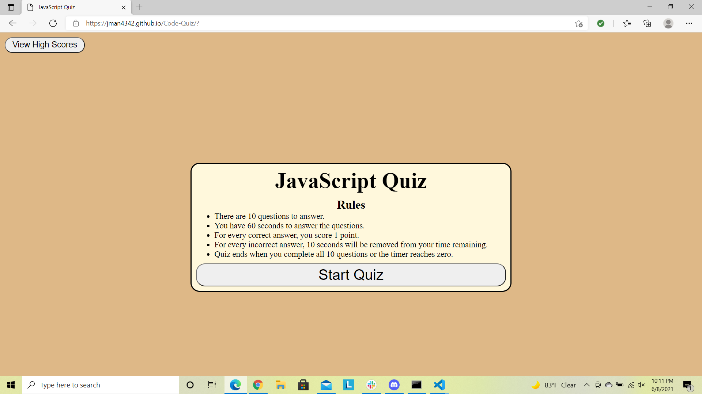
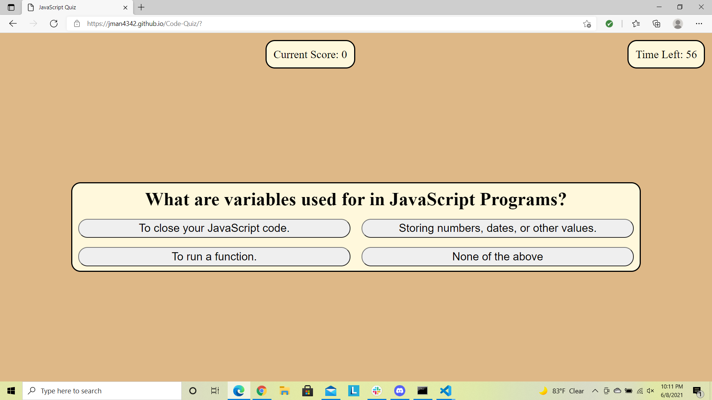
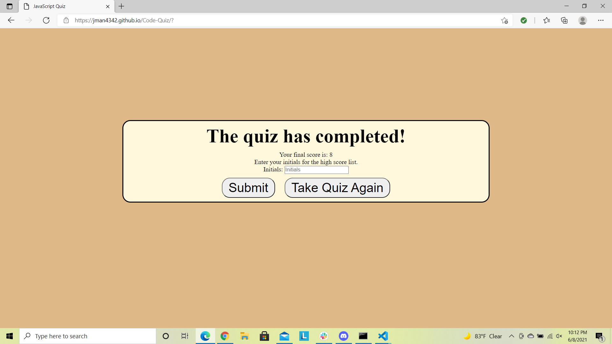
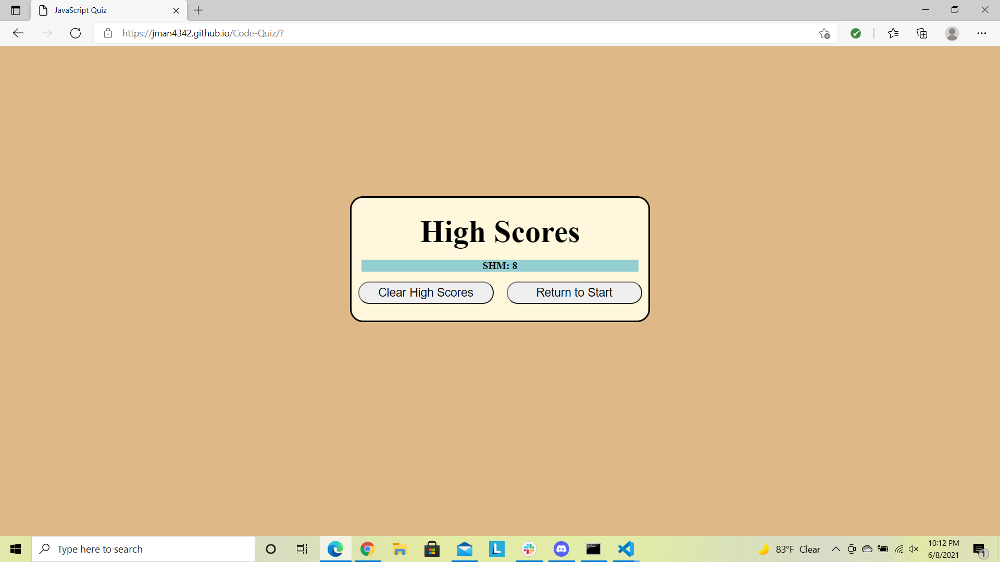

# Code-Quiz
---

## Description

In this assignment, I created a multiple choice quiz to test your knowledge on JavaScript.  Some of the skills demonstrated during this assisgnemt include but not limited to:
* Utilizing local storage to save and recall an array of data for a list of scores.
* Using arrays to produce the questions and answers in a loop function.
* Using querySelectors to pass along JavaScript functions to the HTML file.

---

## Image

Below are images of my completed quiz on JavaScript page.

---

## Resources

I utilized the following sites to assist in creating my JavaScript quiz.
* https://www.w3schools.com/
* https://code-boxx.com/
* https://stackoverflow.com
* https://www.codingcommanders.com/
* https://javascript.info

---

## Application

You can find my JavaScript Quiz page at the following:

* https://jman4342.github.io/Code-Quiz/

---

## Questions
  If you have any questions, I can be reached on my GitHub at [JMan4342](https://github.com/JMan4342).

  You can also reach me by email at manning.joseph.4342@gmail.com.